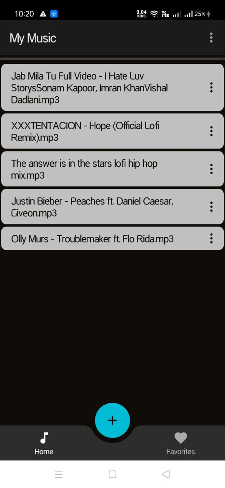

# My-Music
## Music player using Google Firebase and MediaPlayer
> - user can upload and retrieve music files using [Google Firebase](https://firebase.google.com/).
> - user can add or remove song to favorites.
> - every user has separate storage with firebase authentication.

 

